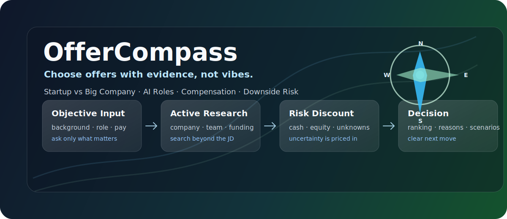
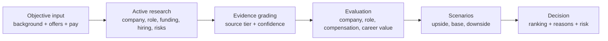

# OfferCompass



**OfferCompass is a Codex Skill for choosing between startup and big-company offers with evidence, not vibes.**

应届生第一份工作很难选：大厂有平台、训练和履历信号；初创有上行、核心机会和更大的不确定性。OfferCompass 的目标不是给一句“看你自己”，而是把候选人背景、公司质量、岗位真实价值、薪资确定性、长期职业价值和下行风险放在同一个决策框架里，给出可执行的推荐排序。

## Why It Exists

很多 offer 选择失败，不是因为人不够聪明，而是因为信息不对称：

- 大厂 offer 看起来稳，但具体部门可能边缘、收缩、训练弱。
- 初创 offer 看起来性感，但融资、现金流、岗位边界、期权价值可能都不清楚。
- AI 岗位 title 很热，但真实工作可能是核心产品、模型产品化、解决方案交付，甚至只是运营杂活。
- 总包数字很容易误导，RSU、期权、bonus、试用期和社保公积金的确定性完全不同。

OfferCompass 把这些问题拆开，用公开搜索、证据分级、风险折扣和情景分析做判断。

## What It Does

```text
Input:  学历背景 + 公司岗位 + 薪资构成
Search: 公司、部门、融资、创始人、招聘、员工、舆情、岗位 JD
Judge:  公司质量、岗位价值、薪资确定性、长期价值、下行风险
Output: 推荐排序、证据、置信度、情景分析、反选理由
```

It helps answer questions like:

- 这个 AI 初创值得去吗？
- 大厂边缘岗和初创核心岗怎么选？
- 两个 offer 总包差不多，哪个风险调整后更好？
- 第一个工作应该更看重平台、现金、成长还是赛道？
- 某个大厂部门是真核心，还是只是公司名气好？

## Minimum Input

第一次使用时，只需要三类客观信息。信息不完整时，Skill 会先追问缺项，不会在证据不足时强行给结论。

```text
1. 学历背景
   学校、学历、专业、是否应届；有实习/项目可以补充。

2. 公司 + 岗位名称
   每个 offer 的公司、岗位；如果知道部门/业务线/地点也一起给。

3. offer 薪资构成
   base、bonus、RSU/期权/股权、签字费等；不知道的可以明确说未知。
```

用户负责提供只有用户知道的客观信息。  
AI 负责搜索用户不容易查全的公开信息。

## Example Prompt

```text
$offer-compass 帮我比较这两个 offer：

背景：杭州电子科技大学计算机硕士，应届。

Offer 1：
抖音 / 剪映 / AI 生图产品经理
薪资：80w 现金 + 30w RSU

Offer 2：
生数科技 / AI 产品经理
薪资：90w 现金 + 20w 股权
```

## Example Output

```text
推荐排序：
1. 抖音 / 剪映 / AI 生图产品经理
2. 生数科技 / AI 产品经理

一句话结论：
如果这是第一份正式工作，剪映/即梦更适合作为默认选择；它的平台信号、用户闭环、训练密度和下行可控性更强。

为什么：
- 两个 offer 名义总包接近，但字节 RSU 的确定性通常高于初创股权。
- 剪映/CapCut/即梦处在 AI 创作工具核心链路，履历更容易被市场理解。
- 生数科技上行更高，但初创风险、岗位边界和股权流动性需要折扣。

生数什么时候反超：
- 岗位明确是 Vidu 核心产品线；
- 现金部分显著更优；
- 股权条款清晰；
- 候选人愿意承受初创波动，并明确想押注 AI 视频生成。

置信度：中高
```

## How It Works



## What Gets Evaluated

| Dimension | What OfferCompass Checks |
|---|---|
| Personal risk budget | 学历背景、校招窗口、平台信号需求、试错修复能力 |
| Company quality | 业务真实性、融资/现金流、组织稳定性、人才密度、负面风险 |
| Role and team value | 岗位是否核心、训练价值、简历信号、团队可见度、职责边界 |
| Compensation | 确定现金、bonus、RSU、期权、股权、隐藏条款、风险调整后价值 |
| Long-term value | 2-5 年可迁移能力、AI 杠杆、平台信号、职业可选项 |
| Risk scenarios | 乐观/基准/悲观情景、下行严重度、可逆性、后悔风险 |

## Research Sources

OfferCompass 会优先使用高可信来源，并把低可信信息只当风险线索：

```text
High confidence:
公司官网、招聘官网、上市公司公告、年报、交易所披露、工商信息、投资方官网、法院/执行信息

Medium confidence:
36氪、晚点、虎嗅、IT桔子、Crunchbase、LinkedIn、GitHub、技术博客、招聘 JD、创始人采访

Low confidence:
脉脉匿名区、牛客面经、看准评价、知乎、小红书、论坛、X/Twitter 单条帖文
```

关键原则：

```text
单一来源不直接下结论。
匿名信息不当事实，只当风险线索。
搜不到关键信息，不甩给用户，而是降低置信度并提高风险折扣。
```

## Install

Clone this repository:

```bash
git clone https://github.com/Bingobingo-L/OfferCompass.git
```

Copy the skill into your Codex skills directory:

```bash
cp -R OfferCompass/offer-compass ~/.codex/skills/
```

Then invoke it in Codex:

```text
$offer-compass 帮我比较这几个应届生 offer...
```

## Repository Structure

```text
offer-compass/
├── SKILL.md
├── agents/
│   └── openai.yaml
├── references/
│   ├── self_assessment.md
│   ├── offer_intake_and_research_protocol.md
│   ├── information_sources_and_research_tools.md
│   ├── company_quality_research_and_evaluation.md
│   ├── role_team_research_and_evaluation.md
│   ├── compensation_and_equity.md
│   ├── long_term_career_value.md
│   ├── risk_scenarios.md
│   ├── decision_framework.md
│   └── output_formats.md
└── scripts/
    ├── generate_queries.py
    ├── classify_sources.py
    └── build_research_pack.py
```

## Built-In Scripts

Generate search queries:

```bash
python3 offer-compass/scripts/generate_queries.py "生数科技" --role "AI产品经理"
```

Classify source confidence:

```bash
python3 offer-compass/scripts/classify_sources.py https://www.sec.gov/edgar/search/
```

Create a research-pack skeleton:

```bash
python3 offer-compass/scripts/build_research_pack.py "生数科技" --role "AI产品经理" --compensation "90w+20w股权"
```

## Philosophy

OfferCompass does not try to predict the future. It tries to make uncertainty explicit.

The best offer is not always the famous company, the highest package, or the hottest AI startup. The best offer is the one whose upside, training value, compensation certainty, and downside risk fit the candidate's real starting point.
